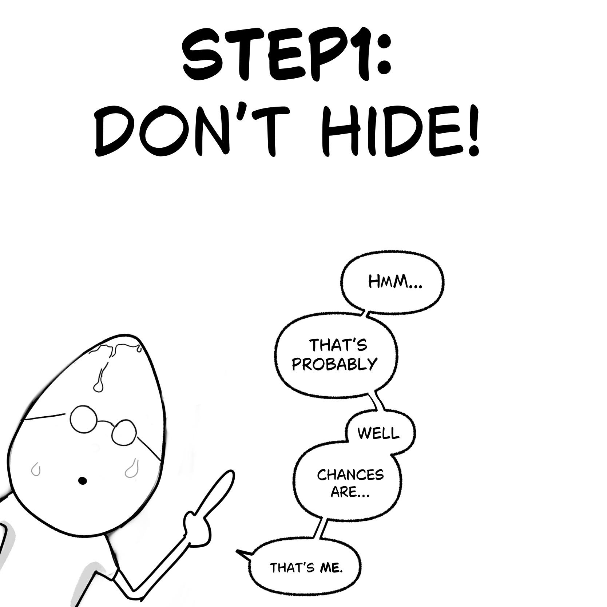
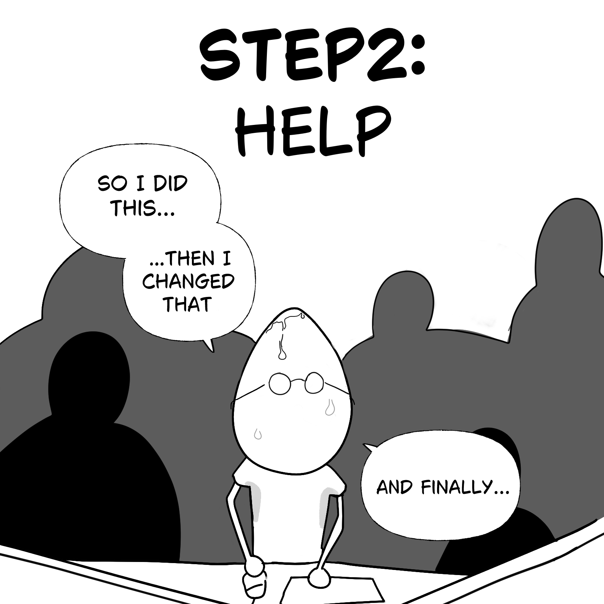
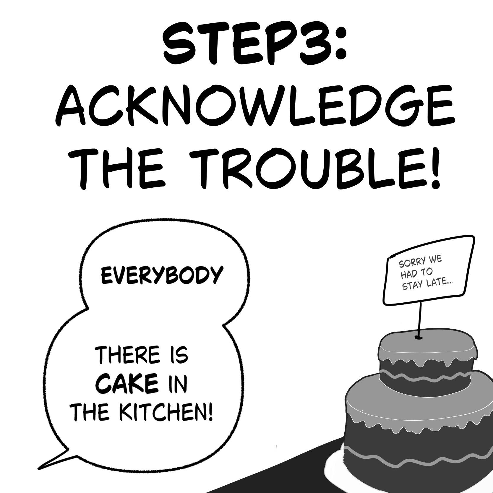
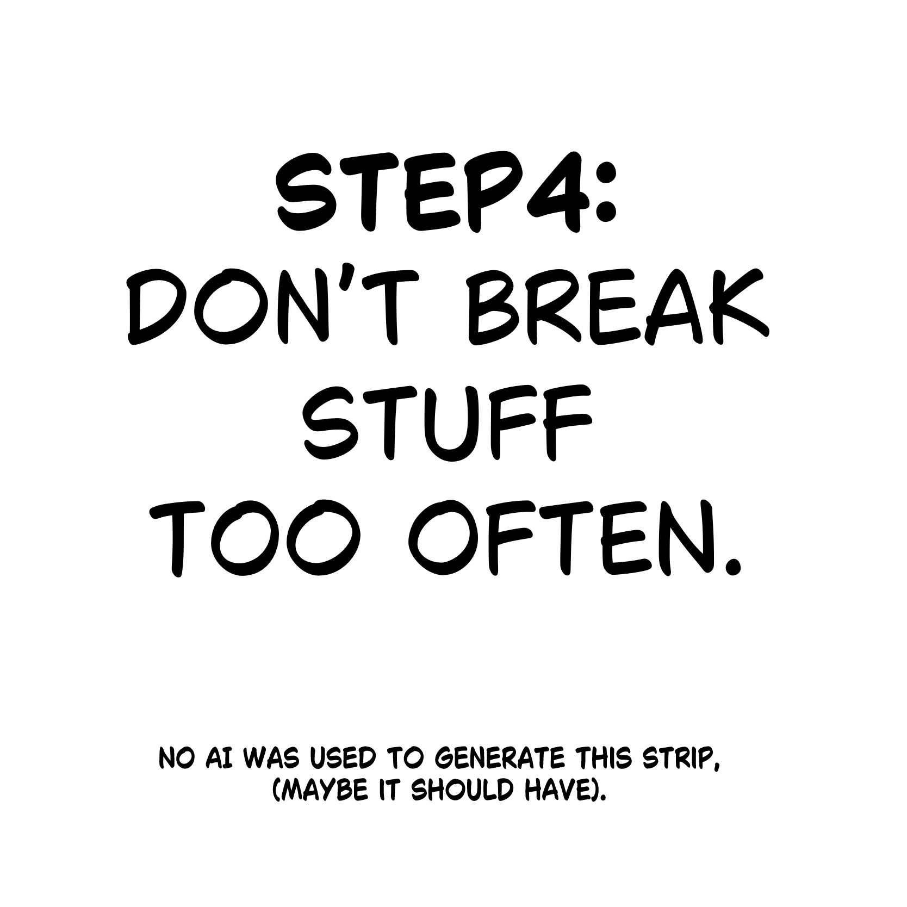

I broke prod. Multiple times. Not too often, but I've got a few good ones on my record.

My finest moment? A mistake so dumb it completely brought down the network of a studio with hundreds of artists for hours.

I was a junior. Maybe slightly overconfident. And I ended up pushing something like this:
```python
idx = 0
while idx < get_directories():  # can return -1
    os.makedirs(f"new_directory_{idx}") 
```

If you're technical, well, you immediately spotted it.
If you're not, well, let's say that these 3 lines had been creating empty folders on common company storage non-stop for days.
Basically till the network slowed down and people complained it was getting slower and slower.

Once senior guys found out about the empty dirs, they looked for the root cause.
Immediately I knew.
My first instinct was to go hide in the bathroom I was so embarrassed — but I decided to face it head on.


Not only did I get through it, I even learned a thing or two along the way.


---

## 1. Own your shit

Don't cover it up, don't hide, don't make excuses. Say it's your fault, loud and clear. It saves everyone from wasting precious time trying to chase down the root cause.

In my case, I messed up the condition of a for-loop. My script was trying to create an empty folder on the network several times per second... and it had been running for days. I must have created tens of thousands of folders before the entire network choked.
Knowing where was this script, how to stop it saved hours of precious troubleshooting time.



---

## 2. Help to fix it

Give all the info, help as much as you can. Explain what you were trying to do, ask for help if you need it. Stay late if you have to — but keep one single focus: fix your mess. Forget everything else.



---

## 3. Acknowledge the consequences

In my case, my script was fixed, but it still took those two veterans an entire afternoon to clean up the file structure and put everything back in order.

It could have stopped there — the company didn't have a blame culture, and I was fortunate.

But I was not at ease with it. Especially those 2 colleagues I put through a lot of stress.
Devs are often easy to win over with food. The next morning, I went to the best bakery and got each of them a cupcake, in a nice individual box. Left them on their desks.

It didn't break the bank, but it was my way of thanking them for the heavy damage control they'd had to do because of me. During the post-mortem, they were great — focusing on the solution and reminding everyone that it's normal to slip up once in a while.



---

## 4. Learn

Once the fire is out, figure out why it happened. What went wrong? What could you have done differently? A code review, a test on a small sample before running in prod, a simple sanity check — often it's not much that would have prevented the whole thing.

Then try not to do it again too soon. Keep a low profile, at least until the cupcakes are digested.

> *"Break prod once, shame on you. Break prod twice, shame still on you (even more)."*


